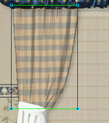
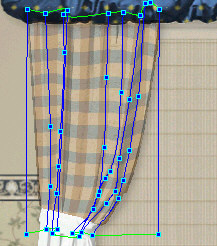
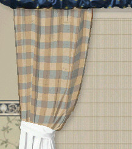

# Questions About the Flowline Page{#questions-about-the-flowline-page}

## What is a Preview Material? {#what-is-a-preview-material}

This is the material that displays while you are creating flowlines. The [!DNL Preview Material] helps you accurately adjust the flowlines so your rendering materials display realistically.

## What size should I make my Flowline Mesh? {#what-size-should-i-make-my-flowline-mesh}

Make it life size, based on the outside lines and not the masked area inside. You know your products. You can estimate how far outside the outside lines sit from the [!DNL Flowline Mesh].

## I added vertical and horizontal lines to my Flowline Mesh and now my Preview Material stretches and pulls whenever I try to move a line or vertex. How can I prevent this from happening? {#i-added-vertical-and-horizontal-lines-to-my-flowline-mesh-and-now-my-preview-material-stretches-and-pulls-whenever-i-try-to-move-a-line-or-vertex-how-can-i-prevent-this-from-happening}

[Cancel](../c-vat-flow-pg/c-vat-flow-mesh-tech/t-vat-reset-flow-mesh.md#task-aa61cad8897341ad82b7177122866b87) the current [!DNL Flowline Mesh] and begin again. Reshape the outline of your mesh first, so that the flow of the mesh is accurately represented. Don't add vertical or horizontal lines until you are ready to distort the pattern to represent folds and creases.

## I've made a MESS of my Flowline Mesh. How can I fix it? {#i-ve-made-a-mess-of-my-flowline-mesh-how-can-i-fix-it}

You can try using [ [!DNL Undo]](../c-vat-ref/r-vat-menus/c-vat-edit-menu.md#concept-5fd6bb8ab58d4b74b9cee7050c101bb6) to fix your mistakes, but sometimes it is best to [delete the [!DNL Flowline Mesh]](../c-vat-flow-pg/c-vat-flow-mesh-tech/t-vat-reset-flow-mesh.md#task-aa61cad8897341ad82b7177122866b87) and start over. Depending on the complexity of your mesh, trying to correct mistakes is more work than starting over.

## How do I delete a line? {#how-do-i-delete-a-line}

You can delete vertexes and lines in the same way.

**To Delete a Line:**

1. Click the line, creating a vertex. 
1. While holding the cursor over the line, right-click. 
1. Select **[!UICONTROL Delete Flowline]**.

## Do I have to add lines and vertexes along all the folds? {#do-i-have-to-add-lines-and-vertexes-along-all-the-folds}

No. Depending on the severity of the fold and the patterns applied to your vignette, the [!DNL Illumination Map] can give the impression of the fold or crease. The [!DNL Illumination Map] is there to support the shadows and contours of your vignette.

## How do I select an object? {#how-do-i-select-an-object}

Click the drop-down box in the top menu and select your group or object. Once an object has a mask, you can select it using Alt+click.

## I created and masked some objects, then went to the Flowline Page, but I cannot seem to get a texture to appear in the Flowline Mesh. {#i-created-and-masked-some-objects-then-went-to-the-flowline-page-but-i-cannot-seem-to-get-a-texture-to-appear-in-the-flowline-mesh}

A texture won't appear for an object if it has no illumination. Go to the [!DNL Illumination] page and [create illumination](../c-vat-work-illum-pg/c-vat-work-illum-maps/t-vat-illum-map-img-auth.md#task-0342a45d98cd456aa4e7cbff6a46ca47) for the object. Also, an illumination map that is too light may not render in a visible way so the current map may need adjusting.

## I'm applying a texture to an object, but I can't seem to make the texture the size I want. {#i-m-applying-a-texture-to-an-object-but-i-can-t-seem-to-make-the-texture-the-size-i-want}

The size of the [texture for a flowline object](../c-vat-flow-pg/c-vat-test-flow-work/t-vat-text-size-flow-obj.md#task-3a9936d1b9c84c238b4e120d1d92a6d9) depends on two settings on the [!DNL Flowline] page:

* The [!DNL Resolution] in the [!DNL Texture Material Properties] dialog box. 

* The [!DNL Overall size] fields in the side menu.

## How can I make fabrics (for drapes or apparel) realistic looking? {#how-can-i-make-fabrics-for-drapes-or-apparel-realistic-looking}

If you have a fabric that contains folds, the default [!DNL Flowline Mesh] causes the texture to have a flat look:

You must add vertical flowlines to the mesh and use various techniques to make the texture flow with the fabric in a more realistic way:

Here's how the drapes look with the [!DNL Flowline Mesh] hidden:

To learn more about flowline techniques, click one of these links:

[Basic](../c-vat-flow-pg/c-vat-create-flow/t-vat-flow-mesh.md#task-d58bc59e2ad6414d906825834ea5356f)

[Advanced](../c-vat-flow-pg/c-vat-flow-mesh-tech/r-vat-adv-flow-mesh-tech.md#reference-f34440d6e29541f8995e728b2aa35eec) 
