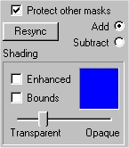
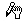
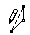

# Questions About the Mask Page{#questions-about-the-mask-page}

## How do I edit a masked area? {#how-do-i-edit-a-masked-area}

**To Edit a Masked Area:**

1. Click either **[!UICONTROL Add]** or **[!UICONTROL Subtract]** from the side menu toolbar.

1. Drag the vertexes (the little blue squares along the mask edge) to reshape the mask. To move a vertex one pixel at a time, use the arrow keys.

    * Roll your mouse over the vertex until you see this icon . 
    * Grab and pull the vertex into place.

1. While tracing your mask, you can add a vertex between two others.

    * Roll your mouse over the line between the two vertexes until you see this icon . 
    * Click and pull the vertex into place.

1. Should you accidentally mask an area outside your masking area, select **[!UICONTROL Subtract]** and mask the area to remove. 
1. Click **[!UICONTROL Apply]** when the mask is the way you want it.

## My shading disappears while I am masking an object. What's wrong? {#my-shading-disappears-while-i-am-masking-an-object-what-s-wrong}

* Check to be sure the **[!UICONTROL Add]** option is selected. 
* Go to the [!DNL Object] page and make sure that what you are trying to mask is an object and not a group.

## I can't save the mask I created-my Apply button is not active. {#i-can-t-save-the-mask-i-created-my-apply-button-is-not-active}

* Go to the [!DNL Object] page and make sure that what you are trying to mask is an object and not a group.

## I am tracing a masked area and my outline keeps crossing over and is not following my outline. What am I doing wrong? {#i-am-tracing-a-masked-area-and-my-outline-keeps-crossing-over-and-is-not-following-my-outline-what-am-i-doing-wrong}

While you are tracing, stay aware of the active vertex, which is red. Your next click connects with the active vertex, so, if you cross from one side of the masked area to another, the mask follows you. If you move back and forth, you cross over your mask outline. Try to trace by following the outline more consistently, not crossing from one side to the other.

## What does the Resync button do? {#what-does-the-resync-button-do}

After you copy or delete an object, you must click the Resync button to adjust mask values and ensure proper rendering of your vignette. Synchronizing the mask after several [!DNL Add] and [!DNL Subtract] operations is a good idea. 
