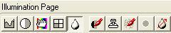

# About the Illumination Page{#about-the-illumination-page}

You use the [!DNL Illumination] page for two separate steps in your vignette creation process:

* [To create or modify the [!DNL Illumination Map]](../../c-vat-work-illum-pg/c-vat-work-illum-maps/t-vat-illum-map-img-auth.md#task-0342a45d98cd456aa4e7cbff6a46ca47). 
* [To render the vignette with patterns](../../c-vat-rend-pg/c-vat-abt-rend-pg/c-vat-abt-rend-pg.md#concept-0a56eec3cafe45658d25c0988d818fc0).

To go to the [!DNL Illumination] page, click the **[!UICONTROL Illumination Page]** button in the toolbar:

The right side of your screen displays the [!DNL Illumination] tool buttons. Click a tool button in the image below to learn about its options, then click **[!UICONTROL Back]** to return to this topic:

>[!MORELIKETHIS]
>
>* [About Illumination Maps](../../c-vat-work-illum-pg/c-vat-abt-illum-pg/c-vat-illum-maps.md#concept-3243a49c92dd4491947481d339d12f3f)
>* [Editing an Illumination Map in Photoshop](../../c-vat-work-illum-pg/c-vat-work-illum-maps/t-vat-illum-map-ps.md#task-6cc4c3a18c544a6f815dd63932fd9172)
