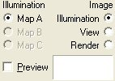

# About Illumination Options{#about-illumination-options}

The options at the bottom of the side window are always available.

**Illumination:** Determines the [!DNL Illumination Map] used for this vignette. Map A is automatically generated when the vignette is created. You can [copy and adjust Map A in the [!DNL View Properties] dialog box](../../c-vat-obj-pg/c-vat-abt-obj-prop/c-vat-view-prop.md#concept-8a396f7b144c46c4806c8ed26619eed1), or you can edit the [!DNL Illumination Map] with a third-party graphics tool such as [!DNL Photoshop]. Multiple [!DNL Illumination Maps] can be used in room scenes, where, for example, a refrigerator may have a shiny metallic finish in addition to the flatter color finishes used for other surfaces. Most vignettes use only Map A.

** [Image](../../c-vat-work-illum-pg/c-vat-abt-illum-pg/c-vat-img-disp-opt.md#concept-636f69f529af40388b1c63d38a22ac8c):** Lets you switch between viewing the grayscale [!DNL Illumination Map], the original photo, or a view of the image rendered with a texture or color.

**Preview:** Lets you preview the selected object or group with a [solid color](../../c-vat-rend-pg/c-vat-rend-obj/t-vat-rend-solid-color.md#task-e051bda9851e4c6fb7e33a38b6e47f0d) when Image is set to either [!DNL View] or [!DNL Render]. 

>[!MORELIKETHIS]
>
>* [About Illumination Maps](../../c-vat-work-illum-pg/c-vat-abt-illum-pg/c-vat-illum-maps.md#concept-3243a49c92dd4491947481d339d12f3f)
>* [Creating an Illumination Map with Image Authoring](../../c-vat-work-illum-pg/c-vat-work-illum-maps/t-vat-illum-map-img-auth.md#task-0342a45d98cd456aa4e7cbff6a46ca47)
>* [Editing an Illumination Map in Photoshop](../../c-vat-work-illum-pg/c-vat-work-illum-maps/t-vat-illum-map-ps.md#task-6cc4c3a18c544a6f815dd63932fd9172)
>* [Previewing the Illumination Map](../../c-vat-work-illum-pg/c-vat-work-illum-maps/t-vat-prev-illum-map.md#task-97d59c12deaf444cbde412761e8d18e1)
>* [Rendering with a Solid Color](../../c-vat-rend-pg/c-vat-rend-obj/t-vat-rend-solid-color.md#task-e051bda9851e4c6fb7e33a38b6e47f0d)
>* [Questions About the Illumination Page](../../c-vat-troubleshooting/r-vat-quest-illum-pg.md#reference-908bdaf3f37e43c1b0a0516f8fb16258)
