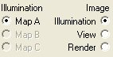

# Choosing an Image Display Option{#choosing-an-image-display-option}

The [!DNL Illumination] page has three image display options:

**Illumination:** Shows you the grayscale [ [!DNL Illumination Map]](../../c-vat-work-illum-pg/c-vat-abt-illum-pg/c-vat-abt-illum-pg.md#concept-1be06b3c0416437088e7cbbba48b3e5f). Choose this when you want to use the [!DNL Illumination] tools to change the [!DNL Illumination Map].

**View:** Shows you the original photo. Choose this to check how the original photo appeared or to preview an object with color applied.

**Render:** Displays the results of applying different materials. 

>[!MORE_LIKE_THIS]
>
>* [About Illumination Options](../../c-vat-work-illum-pg/c-vat-abt-illum-pg/c-vat-illum-opt.md#concept-02c61032870a42869f783f4559e287e5)
>* [About the Illumination Page](../../c-vat-work-illum-pg/c-vat-abt-illum-pg/c-vat-abt-illum-pg.md#concept-1be06b3c0416437088e7cbbba48b3e5f)
>* [Questions About the Illumination Page](../../c-vat-troubleshooting/r-vat-quest-illum-pg.md#reference-908bdaf3f37e43c1b0a0516f8fb16258)
