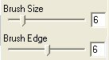

# Choosing a Brush Size and Brush Edge{#choosing-a-brush-size-and-brush-edge}

You can change the brush size for materials tools that have a brush tip.

They are:

[Blur Brush](../../c-vat-work-illum-pg/c-vat-illum-pg-tools/t-vat-blur-brush.md#task-55246cb1b6524aa8828798e78e612dd2)

[Brightness Brush](../../c-vat-refl-pg/c-vat-use-refl-tools/t-vat-bright-brush/t-vat-bright-brush.md#task-402cd15757a44494ada59039d97ffcf7)

[Clone Brush](../../c-vat-work-illum-pg/c-vat-illum-pg-tools/t-vat-clone-brush.md#task-4893e052642148d88a040bf50a3cec8a)

[Noise Brush](../../c-vat-work-illum-pg/c-vat-illum-pg-tools/t-vat-noise-brush.md#task-549f8c37345f4e0f96d516139245c0f0)

[Defringe Brush](../../c-vat-work-illum-pg/c-vat-illum-pg-tools/t-vat-defringe-brush.md#task-0a2d8131d1f04dfe9df6bef72abe2fb3)

[Texture Eraser Brush](../../c-vat-work-illum-pg/c-vat-illum-pg-tools/t-vat-text-eraser-tool.md#task-fd735e7cd6854f6c98d31057f5119c6a)

The [!DNL Brush Size] and [!DNL Brush Edge] controls are at the bottom of the side window.

**To Make the Brush Tip Larger or Smaller:**

* Move the [!DNL Brush Size] slider to the right (for larger) or left (for smaller). 
* You can also press the bracket keys [ and ] on your keyboard to decrease and increase the brush size.

**To Change the Sharpness of the Brush Edge:**

* Move the [!DNL Brush Edge] slider to the right (for sharper) or left (for more diffuse).

**To Change the Brush Stroke to a Polygon Shape:**

* Hold down the Shift key as you brush.

