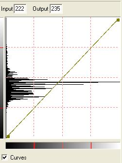

# To Use the Curves Option{#to-use-the-curves-option}

1. Display the [!DNL Histogram] tool on the [!DNL Illumination] page.
1. Check the [!DNL Curves] option.

   

1. Do any of the following:

    * Click the diagonal line to add vertices. Drag a vertex to adjust the curve. 
    * Click a vertex to see its input and output values.

1. When you are finished adjusting the curve, click **[!UICONTROL Action]**, then choose **[!UICONTROL Save to File]**.
1. To apply your changes to the image, click **[!UICONTROL Apply]**.

   You must save the changes before applying them. 

Once you save your [!DNL Curve] settings, you can open and edit them in [!DNL Photoshop]. You can then reload the settings to apply them to the image. 
