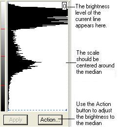
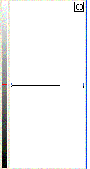
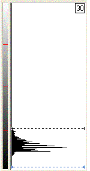
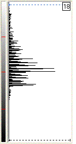

# To Examine an Individual Row in the Histogram{#to-examine-an-individual-row-in-the-histogram}

* Select an object and move the pointer from the top of the [!DNL Histogram] to its bottom.

Each time the pointer moves to a new row, the box in the upper right corner of the [!DNL Histogram] changes to display the number of that row.

The black area on the left side of the [!DNL Histogram] is actually rows of pixels bunched together. When the rows are closer to the bottom of the [!DNL Histogram] (the "0" value), there are more dark values in the current object or group. When the rows are closer to the top of the [!DNL Histogram] (the "255" value), there are more bright values in the [!DNL Histogram].

In the following [!DNL Histogram], there is only one row of black pixels. This means that all the pixels in the current object or group have one brightness value: 69.

In this [!DNL Histogram], the rows of dark pixels are bunched together at the bottom of the [!DNL Histogram], which means that the selected object or group is fairly dark.

In this [!DNL Histogram], the dark rows of pixels run all the way from the top to the bottom. There is a much wider range of dark to bright pixels in the selected object or group. The rows toward the top (brighter) area of the [!DNL Histogram] are longer. The longer the lines of pixels, the more pixels there are at that value in the current object or group.

