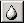

# The Blur Brush{#the-blur-brush}

The Blur Brush blends pixels together. The effect is similar to that of smearing wet paint on a canvas.

 **To Blend Pixels in an Object or Group:** 

1. Select an object or group in the [ [!DNL Select Object] box](../../c-vat-gs/c-vat-sel-obj/c-vat-sel-object-box.md#concept-d127c6efaabd436a96c02f36a7bce6ac).
1. In the side menu, click the [!DNL Blur Brush] .
1. In the image, drag the brush over the area you want to blend.
You can set the following options for the [!DNL Blur Brush]:

* **Blur Effect:** The higher the percentage, the more pronounced the effect. 
* **Filter Size:** Changes the nature of the brush stroke, but the differences are subtle. 
* **Apply to Whole Object:** Applies your changes to the entire object or group that is currently selected. 
* **Adaptive Blur:** Use this option if previous changes you made to the brightness and contrast have introduced banding. You must save the vignette before you can use this

