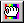

# The Grab Tool{#the-grab-tool}

The Grab tool changes the overall brightness of an object or group depending on where you click in that object or group.

Try for a middle value-not too dark and not too bright.

** To Adjust the Brightness of an Object or Group:** 

1. In the side menu, click the **[!UICONTROL Grab]** tool .
1. Select an object or group in the [ [!DNL Select Object] box](../../c-vat-gs/c-vat-sel-obj/c-vat-sel-object-box.md#concept-d127c6efaabd436a96c02f36a7bce6ac).
1. Do one of the following:

    * **To make the object or group brighter:** Click a dark pixel in the object or group. The darker the pixel, the brighter the object or group becomes. 
    
    * **To make the object or group darker:** Click a bright pixel. The brighter the pixel, the darker the object or group becomes.

      Continue to click in various areas until you are satisfied with the object's or group's illumination.

You can set the following options for the [!DNL Grab] tool:

* **Reduce Contrast:** Changes the range of contrast. The higher the percentage, the less contrast. 
* **Blur Effect:** Blurs the boundaries between areas of differing brightness. The higher the percentage, the more blurring. 
* **Blur Filter Size:** Changes the nature of the brush stroke, but the differences are subtle. 
* **Neutral Color:** Changes to display the color of the pixel you clicked.

