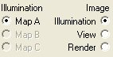

# Creating an Illumination Map with Image Authoring{#creating-an-illumination-map-with-image-authoring}

Image Authoring generates a default Illumination Map when you create your vignette.

On the [!DNL Illumination] page, you can select individual objects or groups and change their brightness and contrast.

You can also adjust the [!DNL Illumination Map] for the unmasked area before you mask objects to affect the entire vignette. Once you mask the objects within the vignette, adjusting the [!DNL Illumination Map] for the unmasked area changes only the unmasked area's [!DNL Illumination Map] and does not affect any masked objects.

Adjustments to individual object illumination are saved as adjustments to the entire [!DNL Illumination Map]. These changes override the overall [!DNL Illumination Map] settings unless you import a new [!DNL Illumination Map] or select everything and make further changes.

If certain materials require different illumination than others, you can use [ [!DNL Render] settings](../../c-vat-rend-pg/c-vat-work-text/c-vat-text-mat-prop/c-vat-render.md#concept-c2c8c5e35662417c9508f85b52b24960) to change illumination options for rendering only, without affecting the [!DNL Illumination Map].

**To Adjust the Illumination Map:** 

1. Click the **[!UICONTROL Illumination Page]** button .
1. In the [!DNL Illumination] page options, choose Map A, B, or C, and set the Image to [!DNL Illumination].

   

   If you are working with a single [!DNL Illumination Map], the default [!DNL Illumination Map] option is Map A. If you have multiple [!DNL Illumination Maps], you can select them to see them.

   The [!DNL Illumination] image option shows you the grayscale [!DNL Illumination Map]. Choose this when you want to use the [!DNL Illumination] tools to change the map. 

1. In the [ [!DNL Select Object] box](../../c-vat-gs/c-vat-sel-obj/c-vat-sel-object-box.md#concept-d127c6efaabd436a96c02f36a7bce6ac) in the toolbar, select an object or group to adjust.

   If you adjust a group, you adjust all the objects in that group. 

1. Use the tools on the [!DNL Illumination] page to change the [!DNL Illumination Map] for the selected object or group:

    * [The **Histogram** tool](../../c-vat-work-illum-pg/c-vat-illum-pg-tools/c-vat-histo-tool/c-vat-histo-tool.md#concept-bee364575d6d49c4a00a3f6609550f24) is similar to the [!DNL Levels] tool in [!DNL Photoshop]. 
    
    * [The **Brightness-Contrast** tool](../../c-vat-work-illum-pg/c-vat-illum-pg-tools/t-vat-bright-contr-tool.md#task-3ec7647fb2104ab0923cc9e8782bee6a) lets you adjust both the brightness and the contrast for the selected object or group using a slider. 
    * [The **Grab** tool ](../../c-vat-work-illum-pg/c-vat-illum-pg-tools/t-vat-grab-tool.md#task-e09d46345f684f7590a8b30ebb0e7c99)lets you adjust the brightness of the entire object or group relative to a single pixel in that object or group. The results are more dramatic than the [!DNL Histogram's], but they are harder to control. 
    
    * [The **Blur Brush**](../../c-vat-work-illum-pg/c-vat-illum-pg-tools/t-vat-blur-brush.md#task-55246cb1b6524aa8828798e78e612dd2) lets you blend pixels in the selected object or group, much like the [!DNL Smudge] tool in [!DNL Photoshop]. 
    
    * [The **Brightness Brush**](../../c-vat-refl-pg/c-vat-use-refl-tools/t-vat-bright-brush/t-vat-bright-brush.md#task-402cd15757a44494ada59039d97ffcf7) lets you paint brightness or darkness onto an area. 
    * [The **Clone Brush**](../../c-vat-work-illum-pg/c-vat-illum-pg-tools/t-vat-clone-brush.md#task-4893e052642148d88a040bf50a3cec8a) lets you copy pixels from one area of the object or group to another, much like the [!DNL Rubber Stamp] tool in [!DNL Photoshop]. 
    
    * [The **Noise Brush**](../../c-vat-work-illum-pg/c-vat-illum-pg-tools/t-vat-noise-brush.md#task-549f8c37345f4e0f96d516139245c0f0) lets you add noise to reduce banding due to high contrast. 
    * [The **Defringe Brush**](../../c-vat-work-illum-pg/c-vat-illum-pg-tools/t-vat-defringe-brush.md#task-0a2d8131d1f04dfe9df6bef72abe2fb3) lets you clean up the edges that produce halo effects due to a mismatch between the [!DNL Illumination Map] and the mask.

1. Save the image to update the [!DNL Illumination Map].
1. [Preview](../../c-vat-work-illum-pg/c-vat-work-illum-maps/t-vat-prev-illum-map.md#task-97d59c12deaf444cbde412761e8d18e1) the results.

   If you don't like the results of your edits, you can [reset the [!DNL Illumination Map]](../../c-vat-work-illum-pg/c-vat-work-illum-maps/t-vat-reset-illum-map.md#task-4b9217cc2a014379a7866e8187c3036b)to its original values or to its last saved values. 

