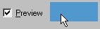

# Previewing the Illumination Map{#previewing-the-illumination-map}

When changing an object's Illumination Map, you work in grayscale.

You can use a color preview to see how the changes in the [!DNL Illumination Map] affect the object once a color is applied.

**To Preview the Illumination Map:** 

1. If you are not already there, go to the **[!UICONTROL Illumination]** page by clicking its button .
1. Click the **[!UICONTROL View]** radio button under [!DNL Image].
1. In the side menu, check **[!UICONTROL Preview]**.
1. Click the color box next to [!DNL Preview] and [choose a color](../../c-vat-rend-pg/c-vat-rend-obj/t-vat-rend-solid-color.md#task-e051bda9851e4c6fb7e33a38b6e47f0d).

   

