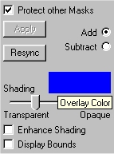

# Choosing a custom color{#choosing-a-custom-color}

1. On the Mask page, click the overlay color box to open the [!DNL Color] dialog box.

   

1. Under [!DNL Custom] colors, click a blank box. The blank box is where the new color is stored.
1. Click **[!UICONTROL Define Custom Colors]**.
1. Do one of the following to choose a color:

    * Click in the large color box. 
    * Enter new values for Hue, Sat, and Lum. 
    * Enter new values for Red, Green and Blue.

1. After you choose a color, click **[!UICONTROL Add to Custom Colors]**.
1. Click **[!UICONTROL OK]**.
The mask color is translucent by default. The color is noticeable, but you can still see the detail of the object. You can change the translucence by dragging the slider.

** Enhanced:** When you choose this option, pixels at the edge of your mask become more pronounced. This can give you a clearer view of the edge and help you catch any stray masking pixels outside the area you intended to mask. After you select **[!UICONTROL Enhanced]**, drag the slider to the right to make the mask color stronger. Use the [!DNL Bounds] check box to make sure that the bounding box for the mask is close to the mask edges. If it isn't, there may be stray pixels that are causing the bounding box to be too large.

** Bounds:** A mask can be virtually any shape, but each mask is surrounded by a rectangular bounding box. The box is invisible by default. Choose this option to display the box. 
