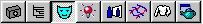
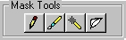
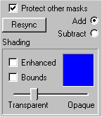

# About the Mask Page{#about-the-mask-page}

After you create the hierarchy of groups and objects for your vignette, you go to the Mask page to define object surfaces.

To go to the [!DNL Mask] page, click the **[!UICONTROL Mask Page]** button in the toolbar:

The right side of your screen displays the **[!UICONTROL Mask]** tool buttons.

At the bottom of the right side of the screen, you can see the [mask options](../../c-vat-work-mask-pg/c-vat-abt-mask-pg/c-vat-abt-mask-opt/c-vat-abt-mask-opt.md#concept-1fe40cc1ab864090b95434d610ee5e70):

The options are available for all three tools.

** Protect Other Masks:** This option protects any existing masks from being overwritten while you work on the current one. It is selected by default.

**Resync:** After you copy or delete a mask, select **[!UICONTROL Resync]** to adjust mask values and ensure proper rendering of your vignette.

**Add/Subtract:** When you first create a mask, you add it to the photo. After the mask is created, you can enlarge the mask by adding to it, or make it smaller by subtracting from it.

**Shading Options:**

* **Enhanced:** When you choose this option, pixels at the edge of your mask become more pronounced. This can give you a clearer view of the edge and help you catch any stray masking pixels outside the area you intended to mask. After you select **[!UICONTROL Enhanced]**, drag the slider to the right to make the mask color stronger. Use the [!DNL Bounds] check box to make sure that the bounding box for the mask is close to the mask edges, if it isn't, there may be stray pixels that are causing the bounding box to be too large. 
* **Bounds:** A mask can be virtually any shape, but each mask is surrounded by a rectangular bounding box. The box is invisible by default. Choose this option to display the box. 
* **Mask Color:** The box that initially displays a blue color is the color for any mask you add. You can change the mask color to another color. 
* **Slider:** The mask color is translucent by default. The color is noticeable, but you can still see the detail of the object. You can change the translucence by dragging the slider.

>[!MORELIKETHIS]
>
>* [About Masks](../../c-vat-work-mask-pg/c-vat-abt-mask-pg/c-vat-abt-masks.md#concept-a6a98ac87e014364bd4a7347de69b033)
>* [Adding a Mask](../../c-vat-work-mask-pg/c-vat-create-mask/t-vat-add-mask.md#task-f8d4ae100d834ace9f90f7f260bf15aa)
>* [About Mask Options](../../c-vat-work-mask-pg/c-vat-abt-mask-pg/c-vat-abt-mask-opt/c-vat-abt-mask-opt.md#concept-1fe40cc1ab864090b95434d610ee5e70)
