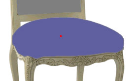
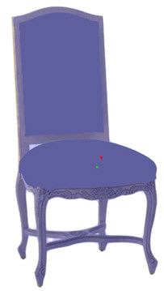

# About Masks{#about-masks}

Masks define the area for each object in your photo.

You create a mask by drawing and applying (saving) an outline around an object. The outline is filled with a translucent blue color (or any color of your choice).

Make sure each mask covers the object precisely as possible, because the color or texture you apply to the object is applied to the masked area.

This seat cushion displays its applied mask:

Here is the whole chair with a mask applied:

>[!MORE_LIKE_THIS]
>
>* [About the Mask Page](../../c-vat-work-mask-pg/c-vat-abt-mask-pg/c-vat-abt-mask-pg.md#concept-1056cf790a8c41a1b1f8d586b2e85c6b)
>* [About Vertexes](../../c-vat-work-mask-pg/c-vat-abt-mask-pg/c-vat-abt-vert.md#concept-3e9b8012386b42be8e00c1a93f9a1af6)
