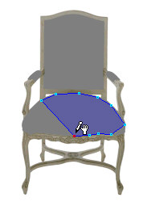

# Adding a mask{#adding-a-mask}

You define the surfaces for each of your objects on the Mask page.

Start by using the [!DNL Trace] tool to click the [vertexes](../../c-vat-work-mask-pg/c-vat-abt-mask-pg/c-vat-abt-vert.md#concept-3e9b8012386b42be8e00c1a93f9a1af6) that create a rough outline of the object. Then use the [ [!DNL Mask Brush]](../../c-vat-work-mask-pg/c-vat-mask-pg-tools/c-vat-mask-brush.md#concept-8a63068b04084b57a4f1ed8fd27fcb72) and [ [!DNL Magic Wand]](../../c-vat-work-mask-pg/c-vat-mask-pg-tools/t-vat-magic-wand.md#task-0b2159df786d499c9aeef0906987f19e) to touch up the resulting outline.

To erase all [!DNL Trace] tool vertexes or [!DNL Magic Wand] strokes at one time, press the **[!UICONTROL Esc]** key.

*  **The Trace Tool:** Use this tool to click the [vertexes](../../c-vat-work-mask-pg/c-vat-create-mask/t-vat-add-mask.md#task-f8d4ae100d834ace9f90f7f260bf15aa). 

*  **The Mask Brush:** Use this tool to paint a mask onto an object. Because the Brush is round, you can use it to smooth out the edges of rounded objects. 

*  **The Magic Wand:**Use this tool to select an entire object with one click if that object is a single, uniform color.

**To add a mask:** 

1. In the side menu toolbar, click the **[!UICONTROL Trace]** tool.
1. In the [ [!DNL Select Object] box](../../c-vat-gs/c-vat-sel-obj/c-vat-sel-object-box.md#concept-d127c6efaabd436a96c02f36a7bce6ac) in the toolbar, select an object to mask.
1. In the side menu toolbar, click **[!UICONTROL Add]**.

   You can also use the + key on your keyboard to change to Add mode. Use the x key to toggle between Add and Subtract. 

1. If desired, use [ [!DNL Edge Recognition]](../../c-vat-work-mask-pg/c-vat-create-mask/t-vat-edge-recog-masks.md#task-4fe94280df4848baae7f6c417890022a) to define default outlines for the objects in the photo.
1. In the photo, click repeatedly along the edges of the object until you have surrounded it with an outline.

   

1. Adjust the mask before you apply it:

    * To add a vertex, click on a line between two existing vertexes. 
    * To remove a vertex you've added, select it and click **[!UICONTROL Delete Vertex]**. 
    * To move a vertex, select and drag it to another location.

1. When the mask is the way you want it, click the **[!UICONTROL Apply]** button in the side menu or press **[!UICONTROL Enter]**.
The outline disappears and the mask is saved. If you accidentally mask an area outside the area you wanted to mask, select the [!DNL Subtract] option (or press the minus key on your keyboard) and mask the area to remove, then click **[!UICONTROL Apply]** again.

If you are creating a [3D vignette](../../c-vat-3d-mod-pg/c-vat-3d-mod-pg.md#concept-3d6fa9b887b84a0c9bfa8354eaa72d81), and there are no [flowline objects](../../r-vat-glossary/c-vat-flowlines.md#concept-d867eba5b7174357a0882dbec8183d9d) in it, [create a [!DNL Reflection Map]](../../c-vat-refl-pg/t-vat-create-refl-map.md#task-d9fd1e5c60df440098920cc955b279c6) before rendering the vignette. 

>[!MORELIKETHIS]
>
>* [About Vertexes](../../c-vat-work-mask-pg/c-vat-abt-mask-pg/c-vat-abt-vert.md#concept-3e9b8012386b42be8e00c1a93f9a1af6)
>* [Questions About the Mask Page](../../c-vat-troubleshooting/r-vat-quest-mask-pg.md#reference-80a4f3d54a6540ed94a939ef2ab7451e)
