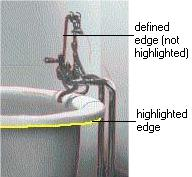

# Using Edge Recognition for Masks{#using-edge-recognition-for-masks}

Defining default edges for objects in your image can be a shortcut for masking those objects.

 [!DNL Image Authoring] looks for areas of high contrast, such as differences in shading or boundaries of different color areas. It draws a line along these boundaries and defines them as edges. When you use the [ [!DNL Trace] tool](../../c-vat-work-mask-pg/c-vat-mask-pg-tools/c-vat-trace-tool.md#concept-8bcad263ddac45e084f0e22e8adb231c), you can link the mask vertexes to the default edges as a shortcut for defining the mask.

**To Use Edge Recognition:** 

1. Select the **[!UICONTROL Trace]** tool  on the [!DNL Mask] page.
1. Click the **[!UICONTROL Edge]** tab.
1. In the [!DNL Extract Edges] from [!DNL Image] dialog box, use [!DNL Save Edge Data in Vignette] if desired, then click **[!UICONTROL OK]**.

   By default, this option is checked. If you don't want to save the data, uncheck this option.

   To see how many edges are stored in your vignette (and to delete them if they are making the vignette too large), use the [!DNL Edges] tab on the [!DNL View Properties] dialog box. ( Ctrl-click  on the toolbar.)

   If you need to extract edges again, use the [!DNL Recalc] button. 

1. Adjust the edge definition as needed using the [!DNL Sensitivity] slider.

   Lowering the sensitivity causes only the highest-contrast areas to be defined as edges. Raising it causes more edges to appear, but they may interfere with the true edges of objects.

   

1. Adjust the display of edges between transparent and opaque.
1. Use the defined edges as you create the object mask:

    * Position the pointer over an edge. The edge turns yellow and an asterisk appears next to the pointer. 
    * Click a point on the edge to include it in the mask. 
    * Slide the pointer along the edge, clicking points to include in the mask. The mask includes all the points defined by the edge between the last vertex and the point you click. 
    * Double-click any enclosed area to add that area to the current mask. The location you double-click defines a starting vertex at the end of the edge line closest to where you double-clicked and an ending vertex at the opposite end of the edge line (farthest from where you double-clicked). 
    * By default, the mask snaps to an edge if it is within a few pixels. To prevent the mask from snapping to edges, hold down the Shift key when you click. 
    * Press the Esc key to cancel all vertexes for the current mask. 
    * Switch between using edges and not using them by clicking the [!DNL Pen] tab. The vertexes that use edge information retain that information unless you adjust them.

1. Press Enter or click **[!UICONTROL Apply]** to apply the current selection to the mask.
