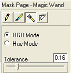
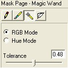
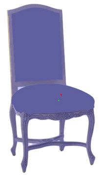
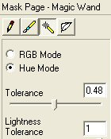

# Options for the Magic Wand Tool{#options-for-the-magic-wand-tool}

 When you select the [!DNL Magic Wand] tool , the following options become available:

* **RGB and Hue Settings:** Use the RGB and Tolerance or the Hue and Lightness Tolerance settings to determine which pixels are included in a mask created with the [!DNL Magic Wand] tool.

For example, when you first select the chair shown below, the RGB option is active, and the Tolerance slider is at a low setting.

If you increase the Tolerance (by dragging its slider to the right), the mask expands to include pixels that have RGB values that are farther away from the RGB values of the seat cushion pixels. When the tolerance amount reaches 48, the whole chair is masked.

You can use Hue and Lightness Tolerance instead of RGB and Tolerance. Hue and Lightness Tolerance look at the brightness of the pixels instead of the RGB values.

* **Edge Feather:** Drag the slider to the left to make the edge of the mask sharper. Drag the slider to the right to make the edge more diffuse. 
* **Despeckle:** If an object contains a wide range of brightness values, move this slider to the right for a more consistent mask. For example, use this setting to smooth a rough surface. 
* **Delete Stroke:** Removes the mask you just applied. You cannot use this to remove a mask after it has been applied.

>[!MORELIKETHIS]
>
>* [About Mask Options](../../c-vat-work-mask-pg/c-vat-abt-mask-pg/c-vat-abt-mask-opt/c-vat-abt-mask-opt.md#concept-1fe40cc1ab864090b95434d610ee5e70)
>* [About the Mask Page](../../c-vat-work-mask-pg/c-vat-abt-mask-pg/c-vat-abt-mask-pg.md#concept-1056cf790a8c41a1b1f8d586b2e85c6b)
>* [The Magic Wand Tool](../../c-vat-work-mask-pg/c-vat-mask-pg-tools/t-vat-magic-wand.md#task-0b2159df786d499c9aeef0906987f19e)
