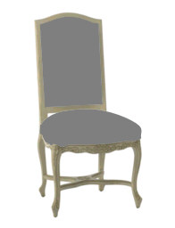
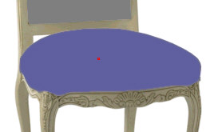

# The Magic Wand Tool{#the-magic-wand-tool}

To mask an object that is a solid color, or close to it, use the Magic Wand tool.

You can often mask the whole object with one click. For example, use the [!DNL Magic Wand] tool for this chair's seat cushion:

**To Create a Mask with the Magic Wand Tool:** 

1. In the side menu toolbar, click the **[!UICONTROL Magic Wand]** tool .
1. In the [ [!DNL Select Object] box](../../c-vat-gs/c-vat-sel-obj/c-vat-sel-object-box.md#concept-d127c6efaabd436a96c02f36a7bce6ac) in the toolbar, select the object you want to mask.
1. In the photo, click the center of the object to mask.
1. [Change the tool options](../../c-vat-work-mask-pg/c-vat-mask-pg-tools/c-vat-opt-magic-wand-tool.md#concept-0d692bc8987044eaa1041cf5fc42d987), if desired.
1. To remove a stroke you've added, select it and click **[!UICONTROL Delete Stroke]**.
1. When the mask is the way you want it, click the **[!UICONTROL Apply]** button in the side menu.

   

>[!MORE_LIKE_THIS]
>
>* [About Mask Options](../../c-vat-work-mask-pg/c-vat-abt-mask-pg/c-vat-abt-mask-opt/c-vat-abt-mask-opt.md#concept-1fe40cc1ab864090b95434d610ee5e70)
>* [About the Mask Page](../../c-vat-work-mask-pg/c-vat-abt-mask-pg/c-vat-abt-mask-pg.md#concept-1056cf790a8c41a1b1f8d586b2e85c6b)
>* [Options for the Magic Wand Tool](../../c-vat-work-mask-pg/c-vat-mask-pg-tools/c-vat-opt-magic-wand-tool.md#concept-0d692bc8987044eaa1041cf5fc42d987)
