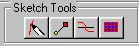

# About the Sketch Page{#about-the-sketch-page}

After you mask the objects in your vignette, you can use the Sketch page to ensure that fabrics follow the contours of objects in the vignette.

Like the [ [!DNL Flowline] page](../../c-vat-flow-pg/c-vat-abt-flow/c-vat-abt-flow.md#concept-2129aa14806e4ec184430ba6a7825a95), the [!DNL Sketch] page defines the mesh for an object, but unlike the [!DNL Flowline] page, the [!DNL Sketch] page uses unconnected Bezier curves and does not start with a flat, box-like mesh.

You use the tools on the [!DNL Sketch] page to create features, which define seams, edges, pleats, folds, and other areas of the object that affect the way fabric flows across it. You can adjust each feature. For example, at places where the fabric folds under, you can adjust the depth of the fold.

If your vignette contains only [Non-Texturable objects](../../c-vat-obj-pg/c-vat-create-grps-obj/t-vat-create-2d-obj.md#task-b0c168d6f127408c882e8f1de36c8bc7), you don't need to create sketch features. Instead, go on to [rendering](../../c-vat-rend-pg/c-vat-abt-rend-pg/c-vat-abt-rend-pg.md#concept-0a56eec3cafe45658d25c0988d818fc0).

To go to the [!DNL Sketch] page, click the **[!UICONTROL Sketch Page]** button in the toolbar:

The right side of your screen displays the [!DNL Sketch] page tool buttons.

If the sketch tools aren't active, make sure a [!DNL Sketch] object is selected in the [ [!DNL Select Object] box](../../c-vat-gs/c-vat-sel-obj/c-vat-sel-object-box.md#concept-d127c6efaabd436a96c02f36a7bce6ac).

If the object you are editing doesn't have illumination, it may not display the texture you choose. Go to the [!DNL Illumination] page and [create illumination](../../c-vat-work-illum-pg/c-vat-work-illum-maps/t-vat-prev-illum-map.md#task-97d59c12deaf444cbde412761e8d18e1) for the object. 
