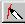

# Using the Edge Recognition for Sketch Features{#using-the-edge-recognition-for-sketch-features}

Defining default edges for Sketch features can be a shortcut for defining those features.

 [!DNL Image Authoring] looks for areas of high contrast, such as differences in shading or boundaries of different color areas. It draws a line along these boundaries and defines them as edges. When you use the [ [!DNL Add Feature] tool](../../c-vat-work-sketch-pg/c-vat-use-sketch-tools/c-vat-add-feat-tool.md#concept-d000c516e3a141d2bd595ca8986cfc0d), you can link the default edges as a shortcut for defining the feature.

**To Use Edge Recognition:** 

1. Select the **[!UICONTROL Add Feature]** tool  on the [!DNL Sketch] page.
1. Click the **[!UICONTROL Edge]** tab.
1. In the [!DNL Extract Edges from Image] dialog box, use [!DNL Save edge data in vignette] if desired, then click **[!UICONTROL OK]**.

   By default, this option is checked. If you don't want to save the data, uncheck this option.

   To see how many edges are stored in your vignette (and to delete them if they are making the vignette too large), use the [!DNL Edges] tab on the [!DNL View Properties] dialog box. ( Ctrl-click  on the toolbar.)

   If you need to extract edges again, use the **[!UICONTROL Recalc]** button. 

1. Adjust the edge definition as needed using the [!DNL Sensitivity] slider.

   Lowering the sensitivity causes only the highest-contrast areas to be defined as edges. Raising it causes more edges to appear, but they may interfere with the true edges of objects. 

1. Adjust the display of edges between transparent and opaque.
1. Use the defined edges as you create the [!DNL Sketch] features:

    * Click and drag along an edge. A circle shows the snap radius. 
    * Hold down the Shift key to ignore image edges.

      The Shift key does not affect snapping to the edge once you have started drawing.

