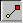

# Editing a Feature{#editing-a-feature}

Use the Edit Feature tool to modify any existing feature.

The feature displays vertexes (control points) and tangents. Tangents are the straight lines that extend from vertexes. Dragging the handles of a tangent changes the angle of the curve. You can drag the vertexes or tangents to change a feature's shape, and you can drag the line sections that appear between vertexes.

**To Edit a Feature:** 

1. Click the **[!UICONTROL Sketch Page]** button  to see the [!DNL Sketch] page (if it isn't already displayed).
1. Make sure the object you want is selected in the [ [!DNL Select Object] box](../../c-vat-gs/c-vat-sel-obj/c-vat-sel-object-box.md#concept-d127c6efaabd436a96c02f36a7bce6ac).
1. Click the **[!UICONTROL Edit Feature]** tool , then click the feature to edit.

   If the [!DNL Add Feature]tool is active, you can click the feature to edit without selecting the [!DNL Edit Feature] tool first. 

1. Do any of the following:

    * To add a vertex to the feature, click the feature where you want the vertex. 
    * Drag the vertexes and tangents to modify the centerline of the feature. Use the arrow keys to move a vertex one pixel at a time.

If you can't see the tangent handles, check the [!DNL Show Tangent Handles] option. If you still cannot see the tangent handles, they may be hidden behind the vertex. Zoom in on the vertex to see them.

* Choose a different feature type for the selected feature from the drop-down list. 
* Use the [!DNL Smoothing] slider to remove vertexes from the feature or add them back in. You can also remove a single vertex by selecting it and pressing the Del key or clicking **[!UICONTROL Delete Vertex]**. 

* Reverse the selected feature by clicking **[!UICONTROL Flip Feature]**. 
* Remove the currently selected feature by clicking **[!UICONTROL Delete Feature]** or pressing the Del key.

