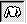

# Changing Feature Profiles{#changing-feature-profiles}

Each sketch feature has a width and height, as well as a length.

When you create a feature, you drag it out to specify its length. The default width and height are determined by the feature type you choose. You can adjust the width and height of [!DNL Folds], [!DNL Ridges], [!DNL Horizon Edges], and [!DNL Object Connectors] with the [!DNL Profile] tool.

**To Adjust the Width and Height of a Feature:** 

1. Click the **[!UICONTROL Sketch Page]** button  to see the Sketch page (if it isn't already displayed).
1. Make sure the [!DNL Sketch] object you want is selected in the [ [!DNL Select Object] box](../../c-vat-gs/c-vat-sel-obj/c-vat-sel-object-box.md#concept-d127c6efaabd436a96c02f36a7bce6ac).
1. Click the **[!UICONTROL Profile]** tool  and click the feature to edit.
1. Do any of the following:

    * To change the width of different parts of the feature, drag the profile handles (the small squares that appear on the feature when this tool is selected).

      By default, a new feature has five profile handles, but you can add more by holding down the Shift key and clicking the feature's centerline. To delete a profile handle, select it and press the Del key or click **[!UICONTROL Delete Profile]**. 
    * To make the entire feature wider, drag the profile edge (indicated by a thin dashed line) away from the centerline. 
    * To change the ratio of width to height (affecting the overall steepness of the feature), adjust the [!DNL Height/Width Ratio] slider. 
    * To taper the ends of the feature, check either or both of the [!DNL Feature Width Taper] checkboxes. 
    * To reverse the selected feature, click **[!UICONTROL Flip Feature]**. 
    * To apply the current width for all features that use profiles ( [!DNL Folds], [!DNL Ridges], [!DNL Horizon Edges], and [!DNL Object Connectors]), click **[!UICONTROL Set Default Width]**. Subsequent features that use profiles will use the new width until you change it again and click this button, or until you exit [!DNL Image Authoring] and restart it.

