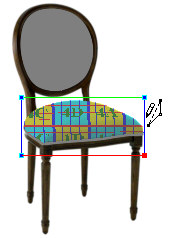

# Flowlines{#flowlines}

Flowlines determine how textures are applied to objects.

Each masked object includes a [!DNL Flowline Mesh]. You manipulate the [!DNL Flowline Mesh] to imitate the curves and folds in the object as closely as possible and determine the starting point of a repeating texture.

This seat cushion displays its default [!DNL Flowline Mesh].

