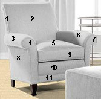

# Object{#object}

An object is any area in an image that can be uniquely decorated.

 In the chair below, each numbered area is a separate object that can display a separate color or pattern:

The chair image requires separate objects because applied fabrics look different on each numbered area. If you want to apply only color to the chair, the whole chair (except its legs) can be a single object. 
