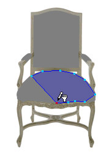
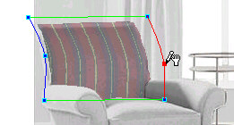

# Vertexes{#vertexes}

Vertexes are little squares that appear when you draw a mask with the [!DNL Trace] tool.

Vertexes also appear on the [!DNL Flowline Mesh], where you use them to shape the [!DNL Mesh].

