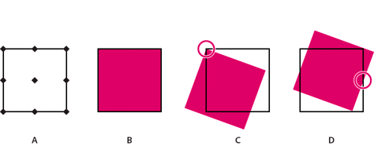

# FXG server protocol{#fxg-server-protocol}

To manipulate a graphic, you can use reference points similar to compass points.

Using reference points, you can rotate, scale, or resize a graphic relative to a particular reference point. The reference points are `northWest`, `north`, `northEast`, `west`, `center`, `east`, `southWest`, `south`, and `southeast`. For example, by using the center reference point, you can rotate a graphic by 45 degrees on its center. This illustration shows where the reference points are located, a graphic, the graphic rotated 20 degrees from its `northWest` reference point, and the graphic rotated 20 degrees from its `east` reference point.

* A. Reference point locations 
* B. A graphic 
* C. The graphic rotated 20 degrees from its `northWest` reference point 
* D. The graphic rotated 20 degrees from its `east` reference point

The syntax is:

`referencePoint <string> (northWest, north, northEast, west, center, east, southWest, south, southEast, none, inherit)`

The default value is none. The `inherit` value passes the `s7:referencePoint` value, provided it is not `none`, from the top of the page or group level to all children. The `none` setting means that there is no reference point for the object and the FXG coordinate system is used.

>[!NOTE]
>
>To use a reference point and not have any displacement in the object after it is manipulated, update the x and y values of the object after you manipulate it.

When a value from `s7:referencePoint` is used with groups (or paths, line elements, or any element that doesn’t have explicit width and height definitions), the value applies to the cumulative bounding box of the group. For example, the top-left point of the bounding box of all the objects in the group serves as the `northWest` reference point for the group; the bottom-right point serves as the `southEast` reference point.
 
