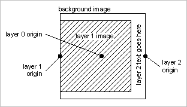

# Example A{#example-a}

Create a fixed-size template with a static background image, a variable image which is aligned with the background at the left-center and scaled to not exceed 80% of the width and height of the background, and one text layer with vertical text centered at the right edge of the canvas.

 

## The template record {#section-32f54710593e438fa0622224c89380af}

Insert object

<table id="simpletable_97ECA49445634F59B3F1D100412EFC70"> 
 <tr class="strow"> 
  <td class="stentry"> 
  catalog::Id  
 </td> 
  <td class="stentry"> 
  myTemplate1  
 </td> 
 </tr> 
 <tr class="strow"> 
  <td class="stentry"> 
  catalog::Modifier  
 </td> 
  <td class="stentry"> 
  src=backgroundImage&amp;size=1000,1000&amp;originN=0,0&amp; layer=1&amp;src=$object$&amp;size=800,800&amp;originN=-0.5,0&amp;posN=-0.5,0&amp; layer=2&amp;$text=layer+2+text+goes+here&amp;text=rtf…$text$…rtf-encoding&amp;rotate=-90&amp;originN=0.5,0&amp;posN=0.5,0  
 </td> 
 </tr> 
</table>

The `origin=` values of all layers are specified explicitly in the template to strictly control positioning and alignment of the layers. Each layer origin is set to match the desired alignment for that layer. The `origin=` for the background (layer 0) is set to the center; this is arbitrary because the background image will not change at run time; any value for the layer 0 origin could be used.

The `pos=` values provide the necessary offsets between the layer origin points, to achieve the desired layer positioning.

The anchor for the layer 1 image is placed at the left-center; in conjunction with the `pos=` value, this achieves the left-center alignment between background and layer 1 image, regardless of the aspect ratio of the layer 1 image.

Similarly, the anchor for the text layer is positioned at the right-center of the auto-sized text box. In conjunction with pos= this achieves the desired right-center alignment for the rotated text, independent of font size and string length.

The actual display text will be provided at run-time, so a variable is used to separate the text from the rtf formatting envelope. We use the default variable `$object` for the layer 1 image. This allows specifying this image in the request path.

Any image may be used for the background image and the layer 1 image. If the background image has a mask, the unmasked areas are filled with the default background color ( `attribute::BkgColor`), or left transparent when `fmt=png-alpha` or `fmt=tif-alpha`. If the background image has a non-square aspect ratio, it is centered in the reply image, and the extra space is filled with `attribute::BkgColor`. If the layer 1 image has alpha data or a mask, the background image (or background color) will remain visible in the transparent areas. If the image has no mask, it will fill the entire allocated rectangle.

## Using the template {#section-3e04eedc268c482db5a8cfc662c0f327}

` http:// *`server`*/myRootId/anotherImage?template=myTemplate1&$text=about+the+image`

The following illustration shows the composite result for different aspect ratios of the layer 1 image and different text strings.

