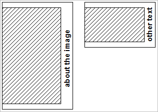

# Example B{#example-b}

Similar requirements as Example A, but use a solid color background and allow the height of the composite to vary, to accommodate images with different aspect ratios.

<table id="simpletable_37BA3B2A75A9468C9ADEBBC034BADAE7"> 
 <tr class="strow"> 
  <td class="stentry"> 
 catalog::Id 
 </td> 
  <td class="stentry"> 
 catalog::Modifier 
</td> 
 </tr> 
 <tr class="strow"> 
  <td class="stentry"> 
 myTemplate2 
</td> 
  <td class="stentry"> 
 $text=layer+1+text+goes+here&amp; layer=0&amp;size=800,0&amp;extend=0,100,200,100&amp;src=$object$&amp;originN=.5,0&amp; layer=1&amp;text=rtf…$text$…rtf-encoding&amp;rotate=-90&amp;originN=.5,0&amp;posN=0.5,0 
</td> 
 </tr> 
</table>

The image is placed in layer 0, and the height value of `size=` is set to 0, which causes the actual height to be determined by the height of the image after scaling it to 800 pixels wide.

`extend=` adds 100 pixels to the top and bottom, and 200 pixels to the right.

The origins for both layer 0 and layer 1 are placed at the center-right of the compositing area, to achieve the desired text position.

The following illustration shows the composite result for different aspect ratios of the image and different text strings.

