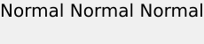
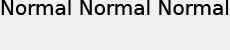
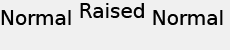

# Text positioning{#text-positioning}

The `text=` renderer positions text fundamentally different from the textPs= renderer when applied to pre-sized layers (that is, when size= is specified as well).

 Self-sizing `text=`and `textPs=` layers have similar appearance and positioning.

The `textPs=` aligns the top of the character cell with the top of the text box (assuming `\vertalt`), even if it results in parts of the rendered text glyphs extending partially outside the text box boundary. Rendered glyphs of certain fonts may also protrude slightly beyond the left and right edges of the text box. For applications requiring all rendered text to be contained within the layer rectangle, the RTF `\marg*` commands or `textFlowPath=` can be used to adjust the text render area.

In contrast, `text=` shifts the rendered text as needed and guarantee that all rendered glyphs fit completely within the specified text box.

While `text=` may be slightly easier to use for simple applications, `textPs=` offers precise positioning independent of font faces and text effects.

## Examples {#section-1b6bdf2ea34447528188ae4e1430ee71}

The following examples are for pre-sized text. Behavior for self-sizing text is different.

** `Text=` always provides a narrow margin at the top:**

`/is/image/?size=230,50&bgc=f0f0f0&fmt=png&text=\fs40Normal%20Normal%20Normal`

** `textPs=` renders text tightly aligned to the top of the text box, which results in slight clipping, even for common fonts such as Arial&reg;:**

`/is/image/?size=230,50&bgc=f0f0f0&fmt=png&textPs=\fs40Normal%20Normal%20Normal`

** `text=` automatically shifts rendered text down to avoid clipping:**

`/is/image?size=230,50&bgc=f0f0f0&fmt=png&text=\fs40Normal%20{\up20Raised%20}Normal`

** `textPs=` does not move text containing raised portions, resulting in significant clipping if the text is on layer 0:**

`/is/image?size=230,50&bgc=f0f0f0&fmt=png&textPs=\fs40Normal%20{\up20Raised%20}Normal`

**A 10 pt (200 twips) margin at the top renders this text without clipping:**

`/is/image?size=230,50&bgc=f0f0f0&fmt=png&textPs=\margt200\fs40Normal%20{\up20Raised}%20Normal`

**Rendered glyphs of certain script fonts may significantly extend outside the text box:**

`/is/image?size=230,50&bgc=f0f0f0&fmt=png&textPs={\fonttbl{\f1\fcharset0%20FluffyFont;}}\f1\fs88%20fluffy%20font%20problems`
