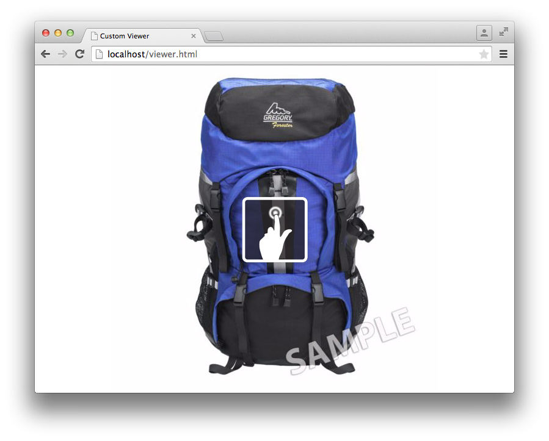
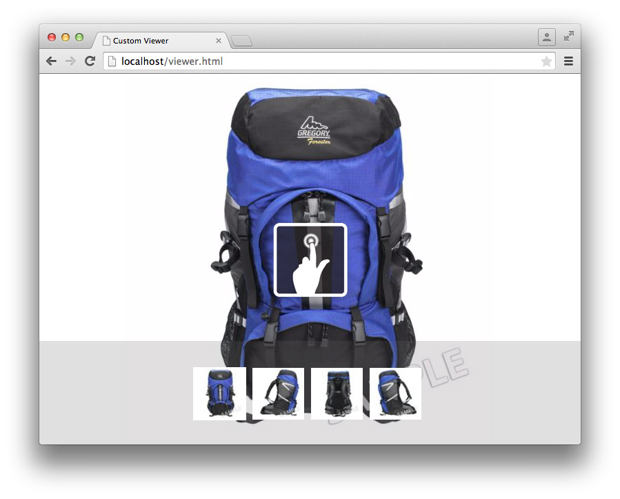
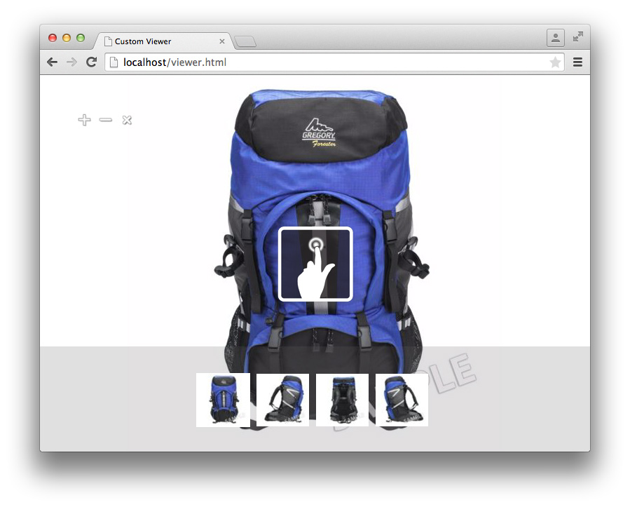
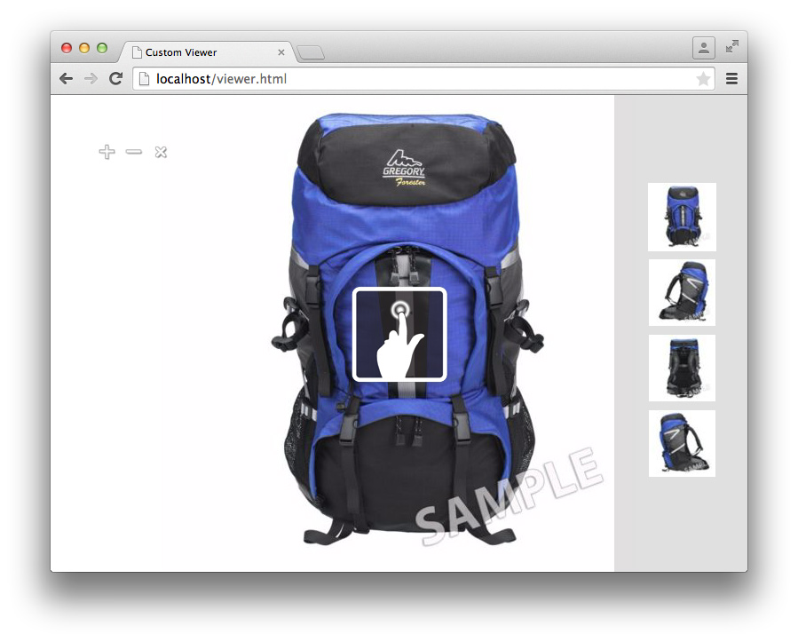

# Viewer SDK Tutorial{#viewer-sdk-tutorial}

The Viewer SDK provides a set of JavaScript-based components for custom viewer development. The viewers are web-based applications that allow for rich media content served by Adobe Dynamic Media to be embedded in web pages.

For example, the SDK provides interactive zooming and panning. It also provides 360° view and video playback of assets that were uploaded to Adobe Dynamic Media through the backend application called Dynamic Media Classic.

Even though the components rely on HTML5 functionality, they are designed to work on Android&trade; and Apple iOS devices, and desktops, including Internet Explorer and later. This kind of experience means that you are able to provide a single workflow for all supported platforms.

The SDK consists of UI Components that make up viewer content. You can style these components through CSS, and non-UI components that have some kind of supporting role, like set definition fetching and parsing or tracking. All component behaviors are customizable through modifiers that you can specify in various ways, for example, as `name=value` pairs in the URL.

This tutorial includes the following order of tasks to help you create a basic zoom viewer:

* [Download the latest Viewer SDK from Adobe Developer Connection](c-tutorial.md#section-84dc74c9d8e24a2380b6cf8fc28d7127) 
* [Load the Viewer SDK](c-tutorial.md#section-98596c276faf4cf79ccf558a9f4432c6) 
* [Adding style to your viewer](c-tutorial.md#section-3783125360a1425eae5a5a334867cc32) 
* [Including Container and ZoomView](c-tutorial.md#section-1a01730663154a508b88cc40c6f35539) 
* [Adding MediaSet and Swatches components to your viewer](c-tutorial.md#section-02b8c21dd842400e83eae2a48ec265b7) 
* [Adding buttons to your viewer](c-tutorial.md#section-1fc334fa0d2b47eb9cdad461725c07be) 
* [Configuring the Swatches vertically](c-tutorial.md#section-91a8829d5b5a4d45a35b7faeb097fcc9)

## Download the latest Viewer SDK from Adobe Developer Connection {#section-84dc74c9d8e24a2380b6cf8fc28d7127}

1. Download the latest Viewer SDK from Adobe Developer Connection <!-- SDK NO LONGER AVAILABLE TO DOWNLOAD;DOUBLE CHECK WITH AMIT. THIS ENTIRE TOPIC IS LIKELY OBSOLETE. [here](https://marketing.adobe.com/developer/devcenter/scene7/show) -->.

   >[!NOTE]
   >
   >You can complete this tutorial without the need to download the Viewer SDK package because the SDK is loaded remotely. However, the Viewer package includes additional examples and an API reference guide that can help you create your own viewers.

## Load the Viewer SDK {#section-98596c276faf4cf79ccf558a9f4432c6}

1. Start by setting up a fresh page to develop the basic zoom viewer that you are going to create.

   Consider this fresh page the Bootstrap &ndash; or loader &ndash; code that you use to set up an empty SDK application. Open your favorite text editor and paste the following HTML markup into it:

   ```html {.line-numbers}
   <!DOCTYPE html> 
   <html> 
       <head> 
           <meta http-equiv="Content-Type" content="text/html; charset=utf-8" /> 
           <meta name="viewport" content="user-scalable=no, height=device-height, width=device-width, initial-scale=1.0, maximum-scale=1.0"/> 
    
           <!-- Hiding the Safari on iPhone OS UI components --> 
           <meta name="apple-mobile-web-app-capable" content="yes"/> 
           <meta name="apple-mobile-web-app-status-bar-style" content="black"/> 
           <meta name="apple-touch-fullscreen" content="no"/> 
    
           <title>Custom Viewer</title> 
    
           <!-- 
               Include Utils.js before you use any of the SDK components. This file  
               contains SDK utilities and global functions that are used to initialize the viewer and load viewer  
               components. The path to the Utils.js determines which version of the SDK that the viewer uses. You  
               can use a relative path if the viewer is deployed on one of the Adobe Dynamic Media servers and it is served  
               from the same domain. Otherwise, specify a full path to one of Adobe Dynamic Media servers that have the SDK  
               installed.  
           --> 
           <script language="javascript" type="text/javascript"      
                   src="http://s7d1.scene7.com/s7sdk/2.8/js/s7sdk/utils/Utils.js"></script> 
    
       </head> 
       <body> 
           <script language="javascript" type="text/javascript"> 
           </script>  
       </body> 
   </html>
   ```

   Add the following JavaScript code inside the `script` tag so it initializes the `ParameterManager`. Doing so helps you prepare to create and instantiate SDK components inside the `initViewer` function:

   ```javascript {.line-numbers}
   /* We create a self-running anonymous function to encapsulate variable scope. Placing code inside such 
      a function is optional, but this prevents variables from polluting the global object.  */ 
   (function () { 
    
       // Initialize the SDK   
       s7sdk.Util.init(); 
    
       /* Create an instance of the ParameterManager component to collect components' configuration 
          that can come from a viewer preset, URL, or the HTML page itself. The ParameterManager  
          component also sends a notification s7sdk.Event.SDK_READY when all needed files are loaded 
          and the configuration parameters are processed. The other components should never be initialized 
          outside this handler. After defining the handler for the s7sdk.Event.SDK_READY event, it 
          is safe to initiate configuration initialization by calling ParameterManager.init(). */ 
       var params = new s7sdk.ParameterManager(); 
    
       /* Event handler for s7sdk.Event.SDK_READY dispatched by ParameterManager to initialize various components of  
          this viewer. */ 
       function initViewer() { 
            
       }  
    
       /* Add event handler for the s7sdk.Event.SDK_READY event dispatched by the ParameterManager when all modifiers 
          are processed and it is safe to initialize the viewer. */ 
       params.addEventListener(s7sdk.Event.SDK_READY, initViewer, false); 
    
       /* Initiate configuration initialization of ParameterManager. */ 
       params.init(); 
        
   }());
   ```

1. Save the file as an empty template. You can use any filename you want.

   You can use this empty template file as a reference when you create any viewers in the future. This template works locally and when served from a web server.

Now add style to your viewer.

## Adding style to your viewer {#section-3783125360a1425eae5a5a334867cc32}

1. For this full page viewer that you are creating, you can add some basic styles.

   Add the following `style` block to the bottom of the `head`:

   ```html {.line-numbers}
   <style> 
       html, body { 
           width: 100%; 
           height: 100%; 
       } 
       body { 
           /* Remove any padding and margin around the edges of the browser window */ 
           padding: 0; 
           margin: 0; 
            
           /* We set overflow to hidden so that scroll bars do not flicker when resizing the window */ 
           overflow: hidden; 
       } 
   </style>
   ```

Now include the components `Container` and `ZoomView`.

## Including Container and ZoomView {#section-1a01730663154a508b88cc40c6f35539}

1. Create an actual viewer by including the components `Container` and `ZoomView`.

   Insert the following `include` statements to the bottom of the `<head>` element—after the [!DNL Utils.js] script is loaded:

   ```javascript {.line-numbers}
   <!-- 
       Add an "include" statement with a related module for each component that is needed for that particular  
       viewer. Check API documentation to see a complete list of components and their modules. 
   --> 
   <script language="javascript" type="text/javascript"> 
       s7sdk.Util.lib.include('s7sdk.common.Container');  
       s7sdk.Util.lib.include('s7sdk.image.ZoomView');  
   </script>
   ```

1. Now create variables to reference the various SDK components.

   Add the following variables to the top of the main anonymous function, just above `s7sdk.Util.init()`:

   ```javascript {.line-numbers}
   var container, zoomView;
   ```

1. Insert the following inside the `initViewer` function so you can define some modifiers and instantiate the respective components:

   ```javascript {.line-numbers}
   /* Modifiers can be added directly to ParameterManager instance */ 
   params.push("serverurl", "http://s7d1.scene7.com/is/image"); 
   params.push("asset", "Scene7SharedAssets/ImageSet-Views-Sample"); 
    
   /* Create a viewer container as a parent component for other user interface components that  
      are part of the viewer application and associate event handlers for resize and  
      full-screen notification. The advantage of using Container as the parent is the  
      component's ability to resize and bring itself and its children to full-screen. */ 
   container = new s7sdk.common.Container(null, params, "s7container"); 
   container.addEventListener(s7sdk.event.ResizeEvent.COMPONENT_RESIZE, containerResize, false); 
    
   /* Create ZoomView component */ 
   zoomView = new s7sdk.image.ZoomView("s7container", params, "myZoomView");  
    
   /* We call this to ensure all SDK components are scaled to initial conditions when viewer loads */ 
   resizeViewer(container.getWidth(), container.getHeight());
   ```

1. For the above code to run properly, add a `containerResize` event handler and a helper function:

   ```javascript {.line-numbers}
   /* Event handler for s7sdk.event.ResizeEvent.COMPONENT_RESIZE events dispatched by Container to resize 
      various view components included in this viewer. */ 
   function containerResize(event) { 
       resizeViewer(event.s7event.w, event.s7event.h); 
   } 
    
   /* Resize viewer components */ 
   function resizeViewer(width, height) { 
       zoomView.resize(width, height); 
   }
   ```

1. Preview the page so you can see what you have created. Your page should look like the following:

   

Now add the components `MediaSet` and `Swatches` to your viewer.

## Adding MediaSet and Swatches components to your viewer {#section-02b8c21dd842400e83eae2a48ec265b7}

1. To give users the ability to select images from a set, you can add the components `MediaSet` and `Swatches`.

   Add the following SDK includes:

   ```javascript {.line-numbers}
   s7sdk.Util.lib.include('s7sdk.set.MediaSet'); 
   s7sdk.Util.lib.include('s7sdk.set.Swatches');
   ```

1. Update the variable list with the following:

   ```javascript {.line-numbers}
   var mediaSet, container, zoomView, swatches;
   ```

1. Instantiate `MediaSet` and `Swatches` components inside the `initViewer` function.

   Be sure to instantiate the `Swatches` instance after the `ZoomView` and `Container` components, otherwise the stacking order hides the `Swatches`:

   ```javascript {.line-numbers}
   // Create MediaSet to manage assets and add event listener to the NOTF_SET_PARSED event 
   mediaSet = new s7sdk.set.MediaSet(null, params, "mediaSet"); 
    
   // Add MediaSet event listener 
   mediaSet.addEventListener(s7sdk.event.AssetEvent.NOTF_SET_PARSED, onSetParsed, false); 
    
   /* create Swatches component and associate event handler for swatch selection notification */ 
   swatches = new s7sdk.set.Swatches("s7container", params, "mySwatches");   
   swatches.addEventListener(s7sdk.event.AssetEvent.SWATCH_SELECTED_EVENT, swatchSelected, false);
   ```

1. Now add the following event handler functions:

   ```javascript {.line-numbers}
   /* Event handler for the s7sdk.event.AssetEvent.NOTF_SET_PARSED event dispatched by MediaSet to 
      assign the asset to the Swatches when parsing is complete. */ 
   function onSetParsed(e) { 
    
       // set media set for Swatches to display  
       var mediasetDesc = e.s7event.asset;  
       swatches.setMediaSet(mediasetDesc); 
    
       // select the first swatch by default  
       swatches.selectSwatch(0, true);      
   } 
    
   /* Event handler for s7sdk.event.AssetEvent.SWATCH_SELECTED_EVENT events dispatched by Swatches to switch 
      the image in the ZoomView when a different swatch is selected. */ 
   function swatchSelected(event) {     
       zoomView.setItem(event.s7event.asset);  
   }
   ```

1. Position the swatches at the bottom of the viewer by adding the following CSS to the `style` element:

   ```CSS {.line-numbers}
   /* Align swatches to bottom of viewer */ 
   .s7swatches { 
       bottom: 0; 
       left: 0; 
       right: 0; 
       height: 150px; 
   }
   ```

1. Preview your viewer.

   Notice that the swatches are in the lower left of the viewer. To have the swatches to take the entire viewer width, add a call to manually resize the swatches whenever the user resizes their browser. Add the following to the `resizeViewer` function:

   ```javascript {.line-numbers}
   swatches.resize(width, swatches.getHeight());
   ```

   Your viewer now looks like the following image. Try resizing the browser window of the viewer and notice the resulting behavior.

   

Now add zoom in, zoom out, and zoom reset buttons to your viewer.

## Adding buttons to your viewer {#section-1fc334fa0d2b47eb9cdad461725c07be}

1. Currently, the user can only zoom using click or touch gestures. Therefore, add some basic zoom control buttons to the viewer.

   Add the following button components:

   ```CSS {.line-numbers}
   s7sdk.Util.lib.include('s7sdk.common.Button');
   ```

1. Update the variable list with the following:

   ```javascript {.line-numbers}
   var mediaSet, container, zoomView, swatches, zoomInButton, zoomOutButton, zoomResetButton;
   ```

1. Instantiate Buttons at the bottom of `initViewer` function.

   Remember that the order matters, unless you specify the `z-index` in CSS:

   ```CSS {.line-numbers}
   /* Create Zoom In, Zoom Out and Zoom Reset buttons */ 
   zoomInButton  = new s7sdk.common.ZoomInButton("s7container", params, "zoomInBtn"); 
   zoomOutButton = new s7sdk.common.ZoomOutButton("s7container", params, "zoomOutBtn"); 
   zoomResetButton = new s7sdk.common.ZoomResetButton("s7container", params, "zoomResetBtn"); 
    
   /* Add handlers for zoom in, zoom out and zoom reset buttons inline. */ 
   zoomInButton.addEventListener("click", function() { zoomView.zoomIn(); }); 
   zoomOutButton.addEventListener("click", function() { zoomView.zoomOut(); }); 
   zoomResetButton.addEventListener("click", function() { zoomView.zoomReset(); });
   ```

1. Now define some basic styles for the buttons by adding the following to the `style` block at the top of your file:

   ```CSS {.line-numbers}
   /* define styles common to all button components and their sub-classes */ 
   .s7button { 
       position:absolute; 
       width: 28px; 
       height: 28px; 
       z-index:100; 
   } 
    
   /* position individual buttons*/ 
   .s7zoominbutton  { 
       top: 50px; 
       left: 50px; 
    } 
   .s7zoomoutbutton  { 
       top: 50px; 
       left: 80px; 
    } 
   .s7zoomresetbutton  { 
       top: 50px; 
       left: 110px; 
    }
   ```

1. Preview your viewer. It should look like the following:

   

   Now configure the Swatches so that they are aligned vertically on the right.

## Configuring the Swatches vertically {#section-91a8829d5b5a4d45a35b7faeb097fcc9}

1. You can configure modifiers directly on the `ParameterManager` instance.

   Add the following to the top of the `initViewer` function so you can configure the `Swatches` thumb layout as a single row:

   ```javascript {.line-numbers}
   params.push("Swatches.tmblayout", "1,0");
   ```

1. Update the following resize call inside `resizeViewer`:

   ```javascript {.line-numbers}
   swatches.resize(swatches.getWidth(), height);
   ```

1. Edit the following `s7swatches` rule in `ZoomViewer.css`:

   ```CSS {.line-numbers}
   .s7swatches { 
       top:0 ; 
       bottom: 0; 
       right: 0; 
       width: 150px; 
   }
   ```

1. Preview your viewer. It looks like the following:

   

   Your basic zoom viewer is now complete.

   This viewer tutorial touches on the fundamentals of what the Dynamic Media Viewer SDK provides. As you work with the SDK, you can use the various standard components to easily build and style rich viewing experiences for your target audiences.
